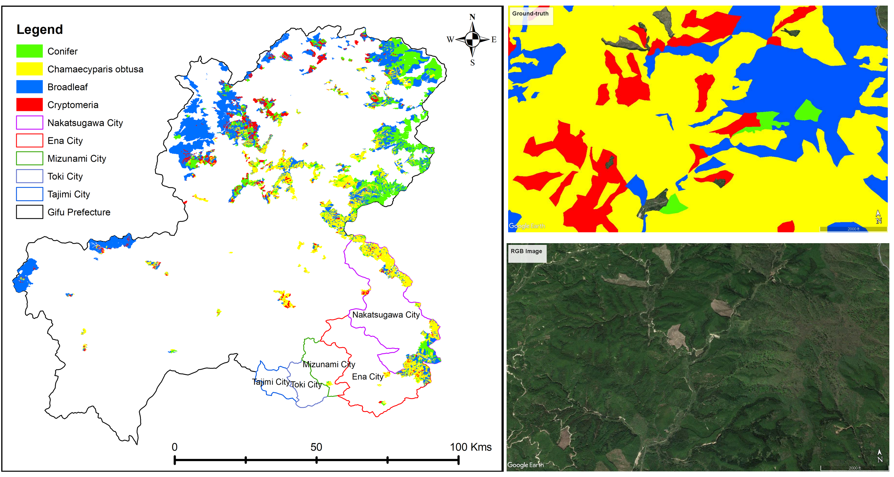

# Forest Attributes Segmentation

**Update on 2022/10/02. Provide reclassification step to enhance the resolution of the result image (only for forest species)**

## Introduction

This is the Pytorch (1.9.1) implementation of Deep Learning model in "FOREST-RELATED SDG ISSUES MONITORING FOR DATA-SCARE REGIONS EMPLOYING MACHINE LEARNING AND REMOTE SENSING - A CASE STUDY FOR ENA CITY, JAPAN".

- Support different 2D/3D UNET based architecture with Atrous Convolution Blocks for forest attribute (species, age) segmentation
- Support training/validation dataset from Sentinel 1/2 in GIFU prefecture - Japan.

### Method

#### Deep learning architecture


#### Reclassification

The Reclassification method will be updated soon

### Study area and data collection

Training data was collected from [国土数値情報ダウンロードサービス](https://nlftp.mlit.go.jp/ksj/gml/datalist/KsjTmplt-A45.html)


### Results


## Installation

The source code is test with Anaconda and Python 3.9.7.

1. Clone the repo:

```Shell
    git clone https://github.com/anhp95/forest_attr_segment.git
    cd forest_attr_segment
```

2. Create a conda environment from as follows:

```Shell
    conda env create -f environment.yml
```

## Training

Follow these steps to train the model with our dataset

1. Download the dataset via [Google Drive](https://drive.google.com/file/d/1cLgWPIXMDjtn05SCAB0bfnY6wyqPUnur/view?usp=sharing)

2. Configure the dataset path in [mypath.py](https://github.com/anhp95/forest_attr_segment/blob/main/mypath.py)

3. Activate your Anaconda environment

4. Input arguments: (see the full set of input arguments via python train.py --help)

   ```Shell
   usage: train_nn.py [-h] [--forest_attr {spec,age}]
                  [--backbone {2d_p2,2d_p1p2,2d_p1p2p3,3d_org,3d_adj,3d_adj_dec_acb,3d_adj_emd_acb,3d_org_emd_acb}]
                  [--num_epochs NUM_EPOCHS] [--batch_size BATCH_SIZE] [--lr LR] [--load_model LOAD_MODEL]
                  [--logs_file LOGS_FILE] [--pin_memory] [--no_workers NO_WORKERS]
   ```

## Inference

1. Input arguments: (see the full set of input arguments via python infer_nn.py --help)

   ```Shell
   usage: infer_nn.py [-h] [--forest_attr {spec,age}]
                  [--backbone {2d_p2,2d_p1p2,2d_p1p2p3,3d_org,3d_adj,3d_adj_dec_acb,3d_adj_emd_acb,3d_org_emd_acb}]
                  [--batch_size BATCH_SIZE] [--region {ena,nakat,mizunami,toki,tajimi,tono}] [--recls {0,1}]
                  [--n_clusters N_CLUSTERS]
   ```

Note. High-resolution inference (Only available for forest species)
